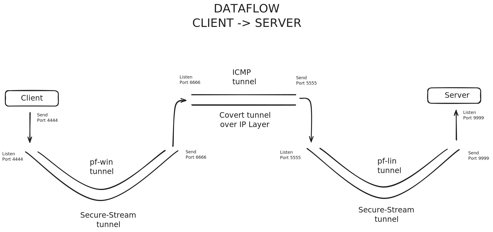

# Stealth Chat

**Stealth Chat** is a secure chat application that uses simple [ROT encryption](https://en.wikipedia.org/wiki/Caesar_cipher) to obfuscate messages and hides communication within [ICMP](https://en.wikipedia.org/wiki/Internet_Control_Message_Protocol) packets. This project uses a combination of [Python](https://www.python.org/downloads/), [Bash](https://en.wikipedia.org/wiki/Bash_(Unix_shell)), and third-party tools to ensure both secure and stealth communication between clients and servers.

## Features

- **Stealth communication**: Hides chat messages in ICMP packets.
- **Encryption**: Uses a simple ROT cipher to encrypt messages.
- **Cross-platform**: Supports both Linux and Windows with the help of ptunnel.
- **Port forwarding**: Ensures secure communication through port forwarding.
- **Bash and Python scripts**: Automates setup and connection handling.

---

## Project Structure
```
.
├── README.md
├── include
│   ├── client-connect.sh
│   ├── line-formatter.sh
│   ├── messenger.sh
│   └── server-connect.sh
├── main-chat.sh
├── pf-lin.py
└── pf-win.py
```

---
# ICMP Packet Structure


# 2 Machine Data Flow Model

# NOTE:
For the sake of simplicity, this project has been modified to chat on loopback address instead of two machines. Users have to run this software within their respective OS, no need to chat inter-OSs. Route the traffic through ports such that, the data gets encrypted, burried in packets and then decrypted approriately.

## Dependencies

- **[ptunnel-ng](https://github.com/utoni/ptunnel-ng)**: A tool to setup ICMP tunnel on WSL
- **[ptunnel](https://github.com/f1vefour/ptunnel)**: A tool to setup ICMP tunnel on MAC (ng version is not available on homebrew)
- **[Python 3](https://www.python.org/downloads/)**: Required for port forwarding.
- **[ncat](https://nmap.org/)**: Netcat tool that comes with nmap

## Installation (Acc to your OS)

### A. Install ptunnel-ng on WSL or Linux

Clone and build ptunnel-ng from the following repository:

```bash
git clone https://github.com/utoni/ptunnel-ng.git
cd ptunnel-ng
chmod +x autogen.sh
./autogen.sh
make install
```
OR
```bash
curl http://ports.ubuntu.com/pool/universe/p/ptunnel-ng/ptunnel-ng_1.42-1_arm64.deb -o ptunnel-ng.deb

sudo dpkg -i ptunnel-ng.deb
```
### B. Install ptunnel-ng on Mac

```bash
brew install ptunnel
```

## Usage

### Step 1: Start ptunnel listner
```bash
On WSL
sudo ptunnel-ng
On MAC OS
sudo ptunnel
```
### Step 2: Connect ptunnel to listener

```bash
On WSL
sudo ptunnel-ng -p127.0.0.1 -l6666 -R5555
On Mac OS
sudo ptunnel -p 127.0.0.1 -lp 6666 -dp 5555 -c lo0
```
### Step 3: Start Secure Tunnel 2
Start port forwarder 2
```bash
python3 pf-lin.py
```
### Step 4: Start Secure Tunnel 1
Start port forwarder 1
```bash
python3 pf-win.py
```
### Step 5: Start the Chat Server
Run the main Bash script to start the chat server
```bash
chmod +x main-chat.sh
./main-chat.sh
```
### Step 6: Connect to the Chat Server
Use `ncat` to connect to the chat server through the secure tunnel:
```bash
ncat 127.0.0.1 4444
```
---
#### If you observe the traffic between 6666 and 5555 on your machine (In implementation of 2 machines, the space between port 6666 and 5555 should be the Internet) with [Wireshark](https://www.wireshark.org/), you will notice that all communication takes place over ICMP and the data within the packet is encrypted as expected
